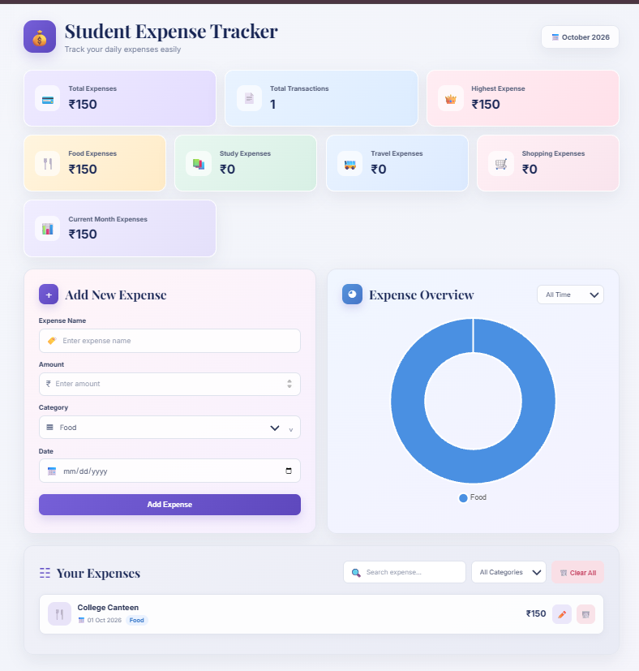

# Student Expense Tracker

A responsive and user-friendly web application designed to help students manage, track, and understand their daily expenses.
## Live Demo

[View Student Expense Tracker](https://singh25376aayushi-lang.github.io/Student-Expense-Tracker/)

## Purpose

The purpose of this project is to build a practical and user-friendly Student Expense Tracker that helps students manage and monitor their daily expenses. This project also demonstrates my skills in HTML, CSS and JavaScript through features such as expense management, search and filtering, data visualization, Local Storage and responsive design.

## Features

- Add new expenses
- Edit existing expenses
- Delete individual expenses
- Clear all expenses
- Search expenses by name
- Filter expenses by category
- Track total expenses
- Track total transactions
- View highest expense
- View category-wise spending
- View current month's expenses
- Interactive doughnut chart
- Monthly chart filter
- Dark theme
- Responsive design for mobile and desktop
- Expense data stored using Local Storage
- Toast notifications for user actions
- Date validation to prevent future dates
  
## Screenshot



## Technologies Used

- HTML5
- CSS3
- JavaScript
- Chart.js
- Local Storage

## Expense Categories

The tracker supports the following categories:

- Food
- Travel
- Study
- Shopping
- Other

## How to Run

1. Clone or download this repository.
2. Open the `index.html` file in a web browser.
3. Start adding and managing your expenses.

## Project Structure

```text
Student-Expense-Tracker/
│
├── index.html
├── style.css
├── script.js
└── README.md
```

## Key Learning

Through this project, I practiced:

- HTML structure and semantic elements
- CSS styling and responsive design
- JavaScript DOM manipulation
- Event handling
- Form validation
- Local Storage
- Array and object handling
- Search and filtering functionality
- Data visualization using Chart.js
- Creating interactive user interfaces

## Future Improvements

- User authentication
- Export expenses to CSV or PDF
- Advanced monthly and yearly reports
- Budget tracking and spending limits
- Cloud-based data storage

## Author

**Ayushi Singh**

B.Tech CSE (AI) Student

---

⭐ If you find this project useful, feel free to explore the repository.
